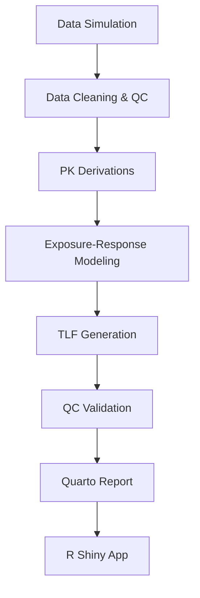

# Project Workflow & Supporting Files

This document summarizes the end-to-end workflow for the Clinical PK/PD Exposure-Response Analysis Demo and provides clickable URLs to key supporting files and the deployed R Shiny app.

## Workflow Steps

### Step Details

- **Data Simulation:** Generate synthetic clinical trial data for PK/PD analysis ([R/data_simulation.R](https://github.com/justin-mbca/pkpd-exposure-response-shiny/blob/main/R/data_simulation.R)).
- **Data Cleaning & QC:** Clean and validate raw data, ensuring accuracy and consistency ([R/data_cleaning.R](https://github.com/justin-mbca/pkpd-exposure-response-shiny/blob/main/R/data_cleaning.R)).
- **PK Derivations:** Calculate PK metrics such as Cmax and AUC ([R/derivations_exposure.R](https://github.com/justin-mbca/pkpd-exposure-response-shiny/blob/main/R/derivations_exposure.R)).
- **Exposure-Response Modeling:** Analyze relationships between drug exposure and clinical response ([R/modeling_exposure_response.R](https://github.com/justin-mbca/pkpd-exposure-response-shiny/blob/main/R/modeling_exposure_response.R)).
- **TLF Generation:** Create tables, listings, and figures for reporting ([R/tlf_generation.R](https://github.com/justin-mbca/pkpd-exposure-response-shiny/blob/main/R/tlf_generation.R)).
- **QC Validation:** Perform automated checks to ensure data and output integrity ([R/qc_validation.R](https://github.com/justin-mbca/pkpd-exposure-response-shiny/blob/main/R/qc_validation.R)).
- **Quarto Report:** Compile a reproducible report for regulatory and stakeholder review ([report/analysis_report.qmd](https://github.com/justin-mbca/pkpd-exposure-response-shiny/blob/main/report/analysis_report.qmd)).
- **README & Overview:** Project overview and instructions ([README.md](https://github.com/justin-mbca/pkpd-exposure-response-shiny/blob/main/README.md)).
- **R Shiny App:** Interactive dashboard for data exploration and presentation ([app/app.R](https://github.com/justin-mbca/pkpd-exposure-response-shiny/blob/main/app/app.R)).

## Deployed R Shiny App

- [View the live dashboard](https://justin-zhang.shinyapps.io/ClinicalPKPDExposureResponse/)

## Repository

- [GitHub Repository](https://github.com/justin-mbca/pkpd-exposure-response-shiny)

---
All files are available in the GitHub repository above. For questions or further details, see the Documentation tab in the R Shiny app.
