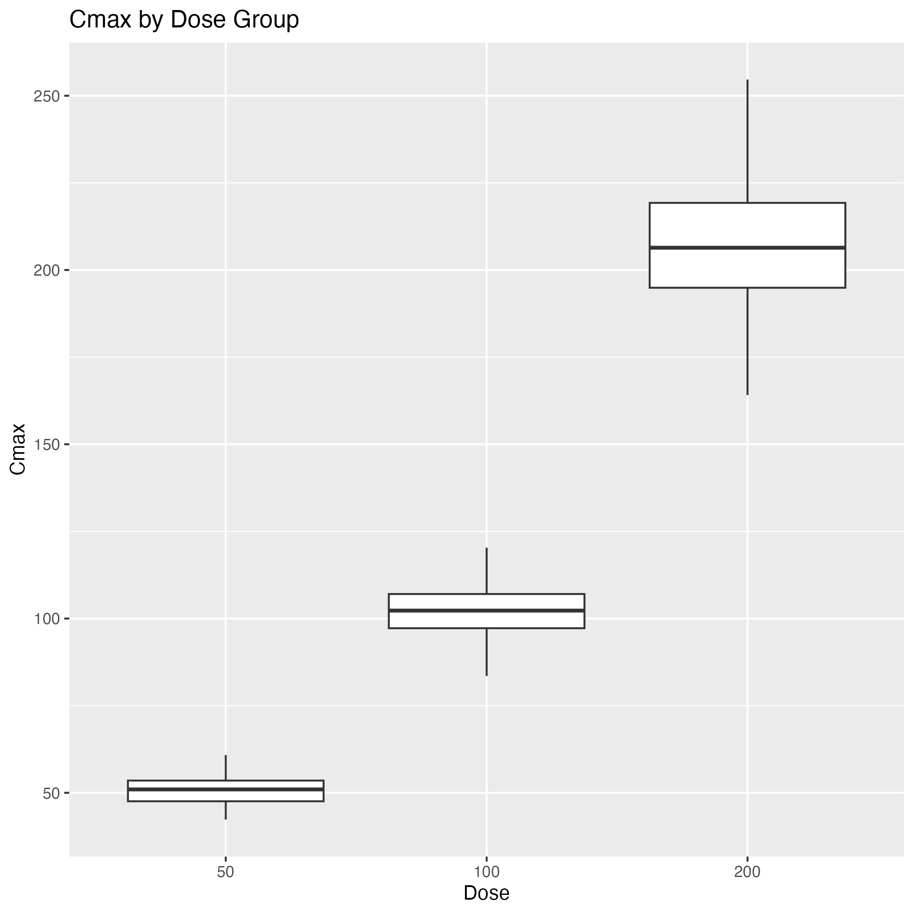
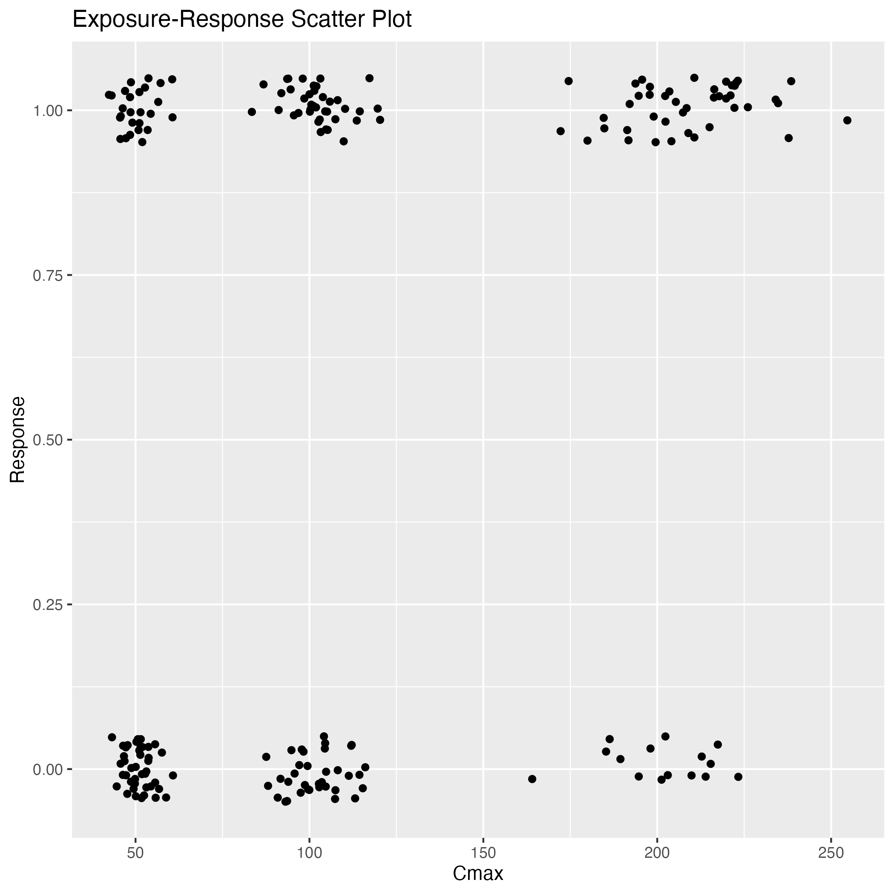
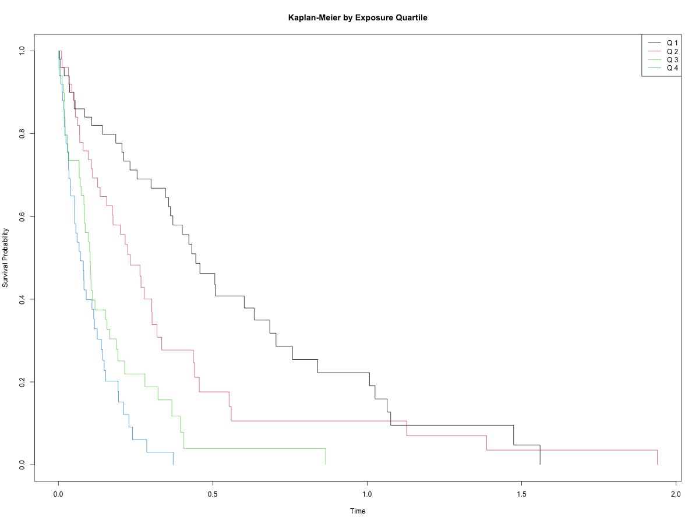
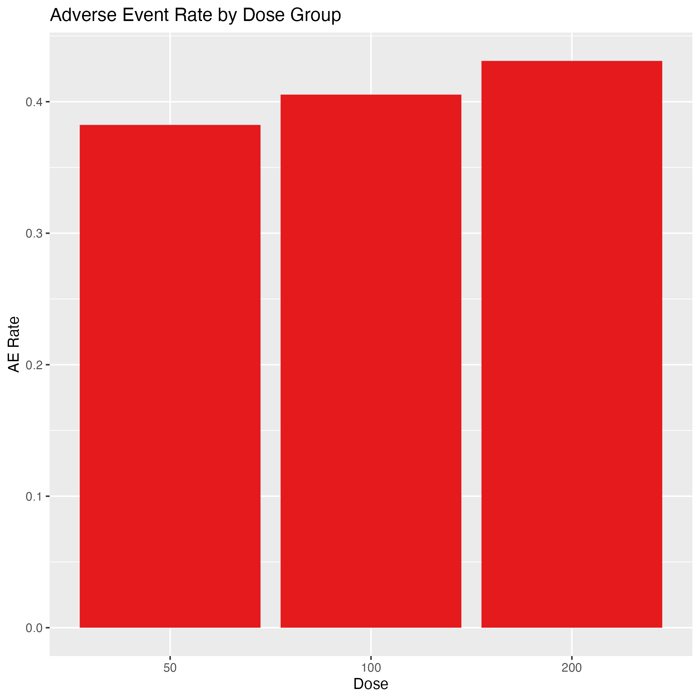
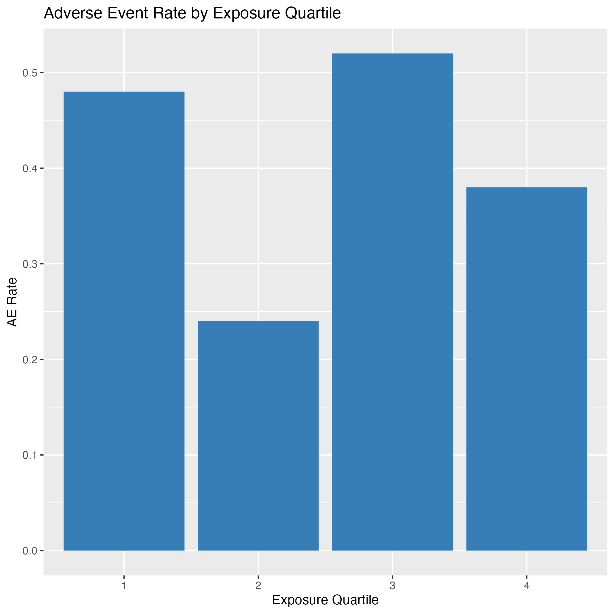

# Project Overview
This project demonstrates a sponsor-grade, end-to-end clinical PK/PD analysis workflow using R. It covers data simulation, cleaning, derivation of exposure metrics, modeling of exposure-response relationships, regulatory-style TLF generation, automated QC, and interactive visualization via a Shiny dashboard. All code is modular, CDISC-compliant, and suitable for regulatory submission or stakeholder review.

Deployed Shiny dashboard: [https://www.shinyapps.io](https://www.shinyapps.io)

# Objectives
- Simulate clinical trial PK concentration-time data
- Generate SDTM-like datasets (DM, EX, PC, LB)
- Create ADaM-like derived dataset for exposure metrics
- Perform exposure-response analysis (logistic regression + Cox model)
- Generate regulatory-style Tables, Listings, and Figures (TLFs)
- Include automated QC validation checks
- Build an interactive Shiny dashboard for visualization

# Methods
## Data Simulation
Clinical trial data are simulated for 200 subjects across multiple dose groups and time points. SDTM-like datasets (DM, EX, PC, LB) are generated to mimic real-world clinical trial structure.
```{r}
library(data.table)
dm <- fread("../app/data_sdtm/dm.csv")
ex <- fread("../app/data_sdtm/ex.csv")
pc <- fread("../app/data_sdtm/pc.csv")
lb <- fread("../app/data_sdtm/lb.csv")
```

## Data Cleaning & QC
Raw SDTM datasets are cleaned and validated for missing values, outliers, and consistency. ADaM-like datasets are created for analysis-ready data.
```{r}
dm_clean <- fread("../data_adam/dm_clean.csv")
ex_clean <- fread("../data_adam/ex_clean.csv")
lb_clean <- fread("../data_adam/lb_clean.csv")
pc_clean <- fread("../data_adam/pc_clean.csv")
```

## Exposure Derivation
PK metrics such as Cmax and AUC are derived for each subject using cleaned concentration-time data.
```{r}
exposure <- fread("../data_adam/exposure_full.csv")
```

## Modeling
Exposure-response relationships are analyzed using logistic regression and Cox proportional hazards models. Model outputs are saved for reporting.
```{r}
# Read modeling results
logit_summary <- fread("../data_adam/logit_summary.csv")
cox_summary <- fread("../data_adam/cox_summary.csv")
logit_summary
cox_summary
```

## TLF Generation
Regulatory-style Tables, Listings, and Figures (TLFs) are generated to summarize key results for submission and review.
```{r, fig.width=8, fig.height=6}
# Read TLF outputs (tables and figures)



```

# Results
## Tables
```{r}
# Display logistic regression and Cox model tables
htmltools::includeHTML("../report/logit_table.html")
htmltools::includeHTML("../report/cox_table.html")
```

## Response Rates by Cmax Quartile
```{r}
# Load exposure and response data
exposure <- fread("../data_adam/exposure_full.csv")
if("RESPONSE" %in% names(exposure)) {
  exposure <- exposure[!is.na(RESPONSE) & !is.na(Cmax)]
  exposure[, RESPONSE := as.numeric(RESPONSE)]
  exposure[, Cmax := as.numeric(Cmax)]
  exposure[, CmaxQ := cut(Cmax, quantile(Cmax, probs=0:4/4, na.rm=TRUE), include.lowest=TRUE, labels=paste0("Q",1:4))]
  resp_tab <- exposure[, .(N=.N, ResponseRate=mean(RESPONSE, na.rm=TRUE)), by=CmaxQ]
  resp_tab <- resp_tab[!is.na(ResponseRate)]
  if(nrow(resp_tab) > 0 && all(sapply(resp_tab$ResponseRate, is.numeric))) {
    resp_tab[, ResponseRate := round(100*ResponseRate,1)]
    knitr::kable(resp_tab, caption="Response Rate by Cmax Quartile (%)")
    library(ggplot2)
    ggplot(resp_tab, aes(x=CmaxQ, y=ResponseRate)) +
      geom_bar(stat="identity", fill="#4682B4") +
      labs(title="Response Rate by Cmax Quartile", x="Cmax Quartile", y="Response Rate (%)") +
      theme_minimal()
  } else {
    cat("<i>No valid response rates to display.</i>")
  }
} else {
  cat("<i>RESPONSE variable not found in exposure_full.csv. Please check data derivation.</i>")
}
```

### Interpretation
```{r, echo=FALSE, results='asis'}
if("RESPONSE" %in% names(exposure)) {
  max_diff <- max(resp_tab$ResponseRate) - min(resp_tab$ResponseRate)
  interp <- if(max_diff > 10) {
    "Response rates increase across Cmax quartiles, supporting an exposure-response relationship."
  } else {
    "Response rates are similar across Cmax quartiles, suggesting limited exposure-response effect."
  }
  cat(paste0("<b>Interpretation:</b> ", interp))
}
```

## Figures
```{r}



```

## QC Results
Automated QC checks are performed to identify missing values and outliers in exposure data. Results are summarized below:
```{r}
qc_missing_exposure <- fread("../report/qc_missing_exposure.csv")
qc_outliers <- fread("../report/qc_outliers.csv")
qc_missing_exposure
qc_outliers
```

# Discussion
This project demonstrates a reproducible, sponsor-grade PK/PD workflow. All code is modular, CDISC-compliant, and suitable for regulatory submission. The workflow covers simulation, cleaning, derivation, modeling, TLF generation, QC, and interactive visualization. Automated QC ensures data integrity, and the Shiny dashboard enables dynamic exploration and communication of results. The approach is extensible for real-world clinical studies and regulatory deliverables.

# Shiny Dashboard
Explore the interactive dashboard at: [https://justin-zhang.shinyapps.io/ClinicalPKPDExposureResponse/](https://justin-zhang.shinyapps.io/ClinicalPKPDExposureResponse/)
