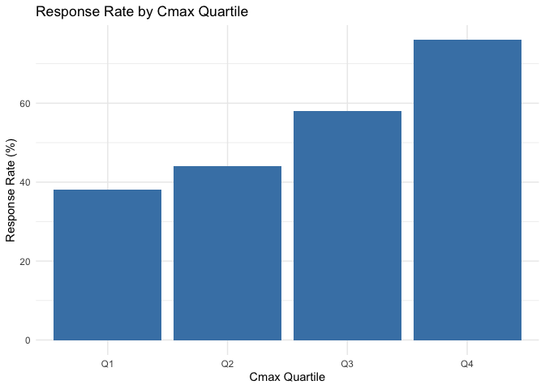

---
author:
- Justin Zhang
authors:
- Justin Zhang
date: 2026-02-28
title: Clinical PK/PD Exposure-Response Analysis Demo
toc-title: Table of contents
---

# Project Overview

This project demonstrates a sponsor-grade, end-to-end clinical PK/PD
analysis workflow using R. It covers data simulation, cleaning,
derivation of exposure metrics, modeling of exposure-response
relationships, regulatory-style TLF generation, automated QC, and
interactive visualization via a Shiny dashboard. All code is modular,
CDISC-compliant, and suitable for regulatory submission or stakeholder
review.

# Objectives

-   Simulate clinical trial PK concentration-time data
-   Generate SDTM-like datasets (DM, EX, PC, LB)
-   Create ADaM-like derived dataset for exposure metrics
-   Perform exposure-response analysis (logistic regression + Cox model)
-   Generate regulatory-style Tables, Listings, and Figures (TLFs)
-   Include automated QC validation checks
-   Build an interactive Shiny dashboard for visualization

# Methods

## Data Simulation

Clinical trial data are simulated for 200 subjects across multiple dose
groups and time points. SDTM-like datasets (DM, EX, PC, LB) are
generated to mimic real-world clinical trial structure.

::: cell
``` {.r .cell-code}
library(data.table)
dm <- fread("../data_sdtm/dm.csv")
ex <- fread("../data_sdtm/ex.csv")
pc <- fread("../data_sdtm/pc.csv")
lb <- fread("../data_sdtm/lb.csv")
```
:::

## Data Cleaning & QC

Raw SDTM datasets are cleaned and validated for missing values,
outliers, and consistency. ADaM-like datasets are created for
analysis-ready data.

::: cell
``` {.r .cell-code}
dm_clean <- fread("../data_adam/dm_clean.csv")
ex_clean <- fread("../data_adam/ex_clean.csv")
lb_clean <- fread("../data_adam/lb_clean.csv")
pc_clean <- fread("../data_adam/pc_clean.csv")
```
:::

## Exposure Derivation

PK metrics such as Cmax and AUC are derived for each subject using
cleaned concentration-time data.

::: cell
``` {.r .cell-code}
exposure <- fread("../data_adam/exposure_full.csv")
```
:::

## Modeling

Exposure-response relationships are analyzed using logistic regression
and Cox proportional hazards models. Model outputs are saved for
reporting.

::::: cell
``` {.r .cell-code}
# Read modeling results
logit_summary <- fread("../data_adam/logit_summary.csv")
cox_summary <- fread("../data_adam/cox_summary.csv")
logit_summary
```

::: {.cell-output .cell-output-stdout}
              term     estimate   std.error  statistic      p.value
    1: (Intercept) -1.291151847 0.592724425 -2.1783341 2.938117e-02
    2:        Cmax  0.010188714 0.002523192  4.0380253 5.390304e-05
    3:         AGE  0.006596105 0.008803548  0.7492553 4.537033e-01
    4:        SEXM -0.055376868 0.299952848 -0.1846186 8.535282e-01
:::

``` {.r .cell-code}
cox_summary
```

::: {.cell-output .cell-output-stdout}
       term     estimate    std.error  statistic      p.value
    1:  AUC  0.002240855 0.0002795765  8.0151758 1.099796e-15
    2:  AGE -0.001955087 0.0047414273 -0.4123414 6.800892e-01
    3: SEXM  0.113357433 0.1603413094  0.7069758 4.795815e-01
:::
:::::

## TLF Generation

Regulatory-style Tables, Listings, and Figures (TLFs) are generated to
summarize key results for submission and review.

:::::: cell
``` {.r .cell-code}
# Read TLF outputs (tables and figures)
knitr::include_graphics("../report/boxplot_cmax.png")
```

::: cell-output-display
{width="2099"}
:::

``` {.r .cell-code}
knitr::include_graphics("../report/exposure_response_scatter.png")
```

::: cell-output-display
{width="2099"}
:::

``` {.r .cell-code}
knitr::include_graphics("../report/km_curve.png")
```

::: cell-output-display
{width="1200"}
:::
::::::

# Results

## Tables

::::::: cell
``` {.r .cell-code}
# Display logistic regression and Cox model tables
htmltools::includeHTML("../report/logit_table.html")
```

::: {.cell-output .cell-output-stderr}
    Warning: `includeHTML()` was provided a `path` that appears to be a complete HTML document.
    ✖ Path: ../report/logit_table.html
    ℹ Use `tags$iframe()` to include an HTML document. You can either ensure `path` is accessible in your app or document (see e.g. `shiny::addResourcePath()`) and pass the relative path to the `src` argument. Or you can read the contents of `path` and pass the contents to `srcdoc`.
:::

::: cell-output-display
<!DOCTYPE html>
<html lang="en">
<head>
<meta charset="utf-8"/>
<style>body{background-color:white;}</style>


</head>
<body>
<div id="ksifyffpej" style="padding-left:0px;padding-right:0px;padding-top:10px;padding-bottom:10px;overflow-x:auto;overflow-y:auto;width:auto;height:auto;">
  <style>#ksifyffpej table {
  font-family: system-ui, 'Segoe UI', Roboto, Helvetica, Arial, sans-serif, 'Apple Color Emoji', 'Segoe UI Emoji', 'Segoe UI Symbol', 'Noto Color Emoji';
  -webkit-font-smoothing: antialiased;
  -moz-osx-font-smoothing: grayscale;
}

#ksifyffpej thead, #ksifyffpej tbody, #ksifyffpej tfoot, #ksifyffpej tr, #ksifyffpej td, #ksifyffpej th {
  border-style: none;
}

#ksifyffpej p {
  margin: 0;
  padding: 0;
}

#ksifyffpej .gt_table {
  display: table;
  border-collapse: collapse;
  line-height: normal;
  margin-left: auto;
  margin-right: auto;
  color: #333333;
  font-size: 16px;
  font-weight: normal;
  font-style: normal;
  background-color: #FFFFFF;
  width: auto;
  border-top-style: solid;
  border-top-width: 2px;
  border-top-color: #A8A8A8;
  border-right-style: none;
  border-right-width: 2px;
  border-right-color: #D3D3D3;
  border-bottom-style: solid;
  border-bottom-width: 2px;
  border-bottom-color: #A8A8A8;
  border-left-style: none;
  border-left-width: 2px;
  border-left-color: #D3D3D3;
}

#ksifyffpej .gt_caption {
  padding-top: 4px;
  padding-bottom: 4px;
}

#ksifyffpej .gt_title {
  color: #333333;
  font-size: 125%;
  font-weight: initial;
  padding-top: 4px;
  padding-bottom: 4px;
  padding-left: 5px;
  padding-right: 5px;
  border-bottom-color: #FFFFFF;
  border-bottom-width: 0;
}

#ksifyffpej .gt_subtitle {
  color: #333333;
  font-size: 85%;
  font-weight: initial;
  padding-top: 3px;
  padding-bottom: 5px;
  padding-left: 5px;
  padding-right: 5px;
  border-top-color: #FFFFFF;
  border-top-width: 0;
}

#ksifyffpej .gt_heading {
  background-color: #FFFFFF;
  text-align: center;
  border-bottom-color: #FFFFFF;
  border-left-style: none;
  border-left-width: 1px;
  border-left-color: #D3D3D3;
  border-right-style: none;
  border-right-width: 1px;
  border-right-color: #D3D3D3;
}

#ksifyffpej .gt_bottom_border {
  border-bottom-style: solid;
  border-bottom-width: 2px;
  border-bottom-color: #D3D3D3;
}

#ksifyffpej .gt_col_headings {
  border-top-style: solid;
  border-top-width: 2px;
  border-top-color: #D3D3D3;
  border-bottom-style: solid;
  border-bottom-width: 2px;
  border-bottom-color: #D3D3D3;
  border-left-style: none;
  border-left-width: 1px;
  border-left-color: #D3D3D3;
  border-right-style: none;
  border-right-width: 1px;
  border-right-color: #D3D3D3;
}

#ksifyffpej .gt_col_heading {
  color: #333333;
  background-color: #FFFFFF;
  font-size: 100%;
  font-weight: normal;
  text-transform: inherit;
  border-left-style: none;
  border-left-width: 1px;
  border-left-color: #D3D3D3;
  border-right-style: none;
  border-right-width: 1px;
  border-right-color: #D3D3D3;
  vertical-align: bottom;
  padding-top: 5px;
  padding-bottom: 6px;
  padding-left: 5px;
  padding-right: 5px;
  overflow-x: hidden;
}

#ksifyffpej .gt_column_spanner_outer {
  color: #333333;
  background-color: #FFFFFF;
  font-size: 100%;
  font-weight: normal;
  text-transform: inherit;
  padding-top: 0;
  padding-bottom: 0;
  padding-left: 4px;
  padding-right: 4px;
}

#ksifyffpej .gt_column_spanner_outer:first-child {
  padding-left: 0;
}

#ksifyffpej .gt_column_spanner_outer:last-child {
  padding-right: 0;
}

#ksifyffpej .gt_column_spanner {
  border-bottom-style: solid;
  border-bottom-width: 2px;
  border-bottom-color: #D3D3D3;
  vertical-align: bottom;
  padding-top: 5px;
  padding-bottom: 5px;
  overflow-x: hidden;
  display: inline-block;
  width: 100%;
}

#ksifyffpej .gt_spanner_row {
  border-bottom-style: hidden;
}

#ksifyffpej .gt_group_heading {
  padding-top: 8px;
  padding-bottom: 8px;
  padding-left: 5px;
  padding-right: 5px;
  color: #333333;
  background-color: #FFFFFF;
  font-size: 100%;
  font-weight: initial;
  text-transform: inherit;
  border-top-style: solid;
  border-top-width: 2px;
  border-top-color: #D3D3D3;
  border-bottom-style: solid;
  border-bottom-width: 2px;
  border-bottom-color: #D3D3D3;
  border-left-style: none;
  border-left-width: 1px;
  border-left-color: #D3D3D3;
  border-right-style: none;
  border-right-width: 1px;
  border-right-color: #D3D3D3;
  vertical-align: middle;
  text-align: left;
}

#ksifyffpej .gt_empty_group_heading {
  padding: 0.5px;
  color: #333333;
  background-color: #FFFFFF;
  font-size: 100%;
  font-weight: initial;
  border-top-style: solid;
  border-top-width: 2px;
  border-top-color: #D3D3D3;
  border-bottom-style: solid;
  border-bottom-width: 2px;
  border-bottom-color: #D3D3D3;
  vertical-align: middle;
}

#ksifyffpej .gt_from_md > :first-child {
  margin-top: 0;
}

#ksifyffpej .gt_from_md > :last-child {
  margin-bottom: 0;
}

#ksifyffpej .gt_row {
  padding-top: 8px;
  padding-bottom: 8px;
  padding-left: 5px;
  padding-right: 5px;
  margin: 10px;
  border-top-style: solid;
  border-top-width: 1px;
  border-top-color: #D3D3D3;
  border-left-style: none;
  border-left-width: 1px;
  border-left-color: #D3D3D3;
  border-right-style: none;
  border-right-width: 1px;
  border-right-color: #D3D3D3;
  vertical-align: middle;
  overflow-x: hidden;
}

#ksifyffpej .gt_stub {
  color: #333333;
  background-color: #FFFFFF;
  font-size: 100%;
  font-weight: initial;
  text-transform: inherit;
  border-right-style: solid;
  border-right-width: 2px;
  border-right-color: #D3D3D3;
  padding-left: 5px;
  padding-right: 5px;
}

#ksifyffpej .gt_stub_row_group {
  color: #333333;
  background-color: #FFFFFF;
  font-size: 100%;
  font-weight: initial;
  text-transform: inherit;
  border-right-style: solid;
  border-right-width: 2px;
  border-right-color: #D3D3D3;
  padding-left: 5px;
  padding-right: 5px;
  vertical-align: top;
}

#ksifyffpej .gt_row_group_first td {
  border-top-width: 2px;
}

#ksifyffpej .gt_row_group_first th {
  border-top-width: 2px;
}

#ksifyffpej .gt_summary_row {
  color: #333333;
  background-color: #FFFFFF;
  text-transform: inherit;
  padding-top: 8px;
  padding-bottom: 8px;
  padding-left: 5px;
  padding-right: 5px;
}

#ksifyffpej .gt_first_summary_row {
  border-top-style: solid;
  border-top-color: #D3D3D3;
}

#ksifyffpej .gt_first_summary_row.thick {
  border-top-width: 2px;
}

#ksifyffpej .gt_last_summary_row {
  padding-top: 8px;
  padding-bottom: 8px;
  padding-left: 5px;
  padding-right: 5px;
  border-bottom-style: solid;
  border-bottom-width: 2px;
  border-bottom-color: #D3D3D3;
}

#ksifyffpej .gt_grand_summary_row {
  color: #333333;
  background-color: #FFFFFF;
  text-transform: inherit;
  padding-top: 8px;
  padding-bottom: 8px;
  padding-left: 5px;
  padding-right: 5px;
}

#ksifyffpej .gt_first_grand_summary_row {
  padding-top: 8px;
  padding-bottom: 8px;
  padding-left: 5px;
  padding-right: 5px;
  border-top-style: double;
  border-top-width: 6px;
  border-top-color: #D3D3D3;
}

#ksifyffpej .gt_last_grand_summary_row_top {
  padding-top: 8px;
  padding-bottom: 8px;
  padding-left: 5px;
  padding-right: 5px;
  border-bottom-style: double;
  border-bottom-width: 6px;
  border-bottom-color: #D3D3D3;
}

#ksifyffpej .gt_striped {
  background-color: rgba(128, 128, 128, 0.05);
}

#ksifyffpej .gt_table_body {
  border-top-style: solid;
  border-top-width: 2px;
  border-top-color: #D3D3D3;
  border-bottom-style: solid;
  border-bottom-width: 2px;
  border-bottom-color: #D3D3D3;
}

#ksifyffpej .gt_footnotes {
  color: #333333;
  background-color: #FFFFFF;
  border-bottom-style: none;
  border-bottom-width: 2px;
  border-bottom-color: #D3D3D3;
  border-left-style: none;
  border-left-width: 2px;
  border-left-color: #D3D3D3;
  border-right-style: none;
  border-right-width: 2px;
  border-right-color: #D3D3D3;
}

#ksifyffpej .gt_footnote {
  margin: 0px;
  font-size: 90%;
  padding-top: 4px;
  padding-bottom: 4px;
  padding-left: 5px;
  padding-right: 5px;
}

#ksifyffpej .gt_sourcenotes {
  color: #333333;
  background-color: #FFFFFF;
  border-bottom-style: none;
  border-bottom-width: 2px;
  border-bottom-color: #D3D3D3;
  border-left-style: none;
  border-left-width: 2px;
  border-left-color: #D3D3D3;
  border-right-style: none;
  border-right-width: 2px;
  border-right-color: #D3D3D3;
}

#ksifyffpej .gt_sourcenote {
  font-size: 90%;
  padding-top: 4px;
  padding-bottom: 4px;
  padding-left: 5px;
  padding-right: 5px;
}

#ksifyffpej .gt_left {
  text-align: left;
}

#ksifyffpej .gt_center {
  text-align: center;
}

#ksifyffpej .gt_right {
  text-align: right;
  font-variant-numeric: tabular-nums;
}

#ksifyffpej .gt_font_normal {
  font-weight: normal;
}

#ksifyffpej .gt_font_bold {
  font-weight: bold;
}

#ksifyffpej .gt_font_italic {
  font-style: italic;
}

#ksifyffpej .gt_super {
  font-size: 65%;
}

#ksifyffpej .gt_footnote_marks {
  font-size: 75%;
  vertical-align: 0.4em;
  position: initial;
}

#ksifyffpej .gt_asterisk {
  font-size: 100%;
  vertical-align: 0;
}

#ksifyffpej .gt_indent_1 {
  text-indent: 5px;
}

#ksifyffpej .gt_indent_2 {
  text-indent: 10px;
}

#ksifyffpej .gt_indent_3 {
  text-indent: 15px;
}

#ksifyffpej .gt_indent_4 {
  text-indent: 20px;
}

#ksifyffpej .gt_indent_5 {
  text-indent: 25px;
}

#ksifyffpej .katex-display {
  display: inline-flex !important;
  margin-bottom: 0.75em !important;
}

#ksifyffpej div.Reactable > div.rt-table > div.rt-thead > div.rt-tr.rt-tr-group-header > div.rt-th-group:after {
  height: 0px !important;
}
</style>
  

  term          estimate       std.error     statistic    p.value
  ------------- -------------- ------------- ------------ --------------
  (Intercept)   -1.291151847   0.592724425   -2.1783341   2.938117e-02
  Cmax          0.010188714    0.002523192   4.0380253    5.390304e-05
  AGE           0.006596105    0.008803548   0.7492553    4.537033e-01
  SEXM          -0.055376868   0.299952848   -0.1846186   8.535282e-01

</div>
</body>
</html>
:::

``` {.r .cell-code}
htmltools::includeHTML("../report/cox_table.html")
```

::: {.cell-output .cell-output-stderr}
    Warning: `includeHTML()` was provided a `path` that appears to be a complete HTML document.
    ✖ Path: ../report/cox_table.html
    ℹ Use `tags$iframe()` to include an HTML document. You can either ensure `path` is accessible in your app or document (see e.g. `shiny::addResourcePath()`) and pass the relative path to the `src` argument. Or you can read the contents of `path` and pass the contents to `srcdoc`.
:::

::: cell-output-display
<!DOCTYPE html>
<html lang="en">
<head>
<meta charset="utf-8"/>
<style>body{background-color:white;}</style>


</head>
<body>
<div id="xzphabpqby" style="padding-left:0px;padding-right:0px;padding-top:10px;padding-bottom:10px;overflow-x:auto;overflow-y:auto;width:auto;height:auto;">
  <style>#xzphabpqby table {
  font-family: system-ui, 'Segoe UI', Roboto, Helvetica, Arial, sans-serif, 'Apple Color Emoji', 'Segoe UI Emoji', 'Segoe UI Symbol', 'Noto Color Emoji';
  -webkit-font-smoothing: antialiased;
  -moz-osx-font-smoothing: grayscale;
}

#xzphabpqby thead, #xzphabpqby tbody, #xzphabpqby tfoot, #xzphabpqby tr, #xzphabpqby td, #xzphabpqby th {
  border-style: none;
}

#xzphabpqby p {
  margin: 0;
  padding: 0;
}

#xzphabpqby .gt_table {
  display: table;
  border-collapse: collapse;
  line-height: normal;
  margin-left: auto;
  margin-right: auto;
  color: #333333;
  font-size: 16px;
  font-weight: normal;
  font-style: normal;
  background-color: #FFFFFF;
  width: auto;
  border-top-style: solid;
  border-top-width: 2px;
  border-top-color: #A8A8A8;
  border-right-style: none;
  border-right-width: 2px;
  border-right-color: #D3D3D3;
  border-bottom-style: solid;
  border-bottom-width: 2px;
  border-bottom-color: #A8A8A8;
  border-left-style: none;
  border-left-width: 2px;
  border-left-color: #D3D3D3;
}

#xzphabpqby .gt_caption {
  padding-top: 4px;
  padding-bottom: 4px;
}

#xzphabpqby .gt_title {
  color: #333333;
  font-size: 125%;
  font-weight: initial;
  padding-top: 4px;
  padding-bottom: 4px;
  padding-left: 5px;
  padding-right: 5px;
  border-bottom-color: #FFFFFF;
  border-bottom-width: 0;
}

#xzphabpqby .gt_subtitle {
  color: #333333;
  font-size: 85%;
  font-weight: initial;
  padding-top: 3px;
  padding-bottom: 5px;
  padding-left: 5px;
  padding-right: 5px;
  border-top-color: #FFFFFF;
  border-top-width: 0;
}

#xzphabpqby .gt_heading {
  background-color: #FFFFFF;
  text-align: center;
  border-bottom-color: #FFFFFF;
  border-left-style: none;
  border-left-width: 1px;
  border-left-color: #D3D3D3;
  border-right-style: none;
  border-right-width: 1px;
  border-right-color: #D3D3D3;
}

#xzphabpqby .gt_bottom_border {
  border-bottom-style: solid;
  border-bottom-width: 2px;
  border-bottom-color: #D3D3D3;
}

#xzphabpqby .gt_col_headings {
  border-top-style: solid;
  border-top-width: 2px;
  border-top-color: #D3D3D3;
  border-bottom-style: solid;
  border-bottom-width: 2px;
  border-bottom-color: #D3D3D3;
  border-left-style: none;
  border-left-width: 1px;
  border-left-color: #D3D3D3;
  border-right-style: none;
  border-right-width: 1px;
  border-right-color: #D3D3D3;
}

#xzphabpqby .gt_col_heading {
  color: #333333;
  background-color: #FFFFFF;
  font-size: 100%;
  font-weight: normal;
  text-transform: inherit;
  border-left-style: none;
  border-left-width: 1px;
  border-left-color: #D3D3D3;
  border-right-style: none;
  border-right-width: 1px;
  border-right-color: #D3D3D3;
  vertical-align: bottom;
  padding-top: 5px;
  padding-bottom: 6px;
  padding-left: 5px;
  padding-right: 5px;
  overflow-x: hidden;
}

#xzphabpqby .gt_column_spanner_outer {
  color: #333333;
  background-color: #FFFFFF;
  font-size: 100%;
  font-weight: normal;
  text-transform: inherit;
  padding-top: 0;
  padding-bottom: 0;
  padding-left: 4px;
  padding-right: 4px;
}

#xzphabpqby .gt_column_spanner_outer:first-child {
  padding-left: 0;
}

#xzphabpqby .gt_column_spanner_outer:last-child {
  padding-right: 0;
}

#xzphabpqby .gt_column_spanner {
  border-bottom-style: solid;
  border-bottom-width: 2px;
  border-bottom-color: #D3D3D3;
  vertical-align: bottom;
  padding-top: 5px;
  padding-bottom: 5px;
  overflow-x: hidden;
  display: inline-block;
  width: 100%;
}

#xzphabpqby .gt_spanner_row {
  border-bottom-style: hidden;
}

#xzphabpqby .gt_group_heading {
  padding-top: 8px;
  padding-bottom: 8px;
  padding-left: 5px;
  padding-right: 5px;
  color: #333333;
  background-color: #FFFFFF;
  font-size: 100%;
  font-weight: initial;
  text-transform: inherit;
  border-top-style: solid;
  border-top-width: 2px;
  border-top-color: #D3D3D3;
  border-bottom-style: solid;
  border-bottom-width: 2px;
  border-bottom-color: #D3D3D3;
  border-left-style: none;
  border-left-width: 1px;
  border-left-color: #D3D3D3;
  border-right-style: none;
  border-right-width: 1px;
  border-right-color: #D3D3D3;
  vertical-align: middle;
  text-align: left;
}

#xzphabpqby .gt_empty_group_heading {
  padding: 0.5px;
  color: #333333;
  background-color: #FFFFFF;
  font-size: 100%;
  font-weight: initial;
  border-top-style: solid;
  border-top-width: 2px;
  border-top-color: #D3D3D3;
  border-bottom-style: solid;
  border-bottom-width: 2px;
  border-bottom-color: #D3D3D3;
  vertical-align: middle;
}

#xzphabpqby .gt_from_md > :first-child {
  margin-top: 0;
}

#xzphabpqby .gt_from_md > :last-child {
  margin-bottom: 0;
}

#xzphabpqby .gt_row {
  padding-top: 8px;
  padding-bottom: 8px;
  padding-left: 5px;
  padding-right: 5px;
  margin: 10px;
  border-top-style: solid;
  border-top-width: 1px;
  border-top-color: #D3D3D3;
  border-left-style: none;
  border-left-width: 1px;
  border-left-color: #D3D3D3;
  border-right-style: none;
  border-right-width: 1px;
  border-right-color: #D3D3D3;
  vertical-align: middle;
  overflow-x: hidden;
}

#xzphabpqby .gt_stub {
  color: #333333;
  background-color: #FFFFFF;
  font-size: 100%;
  font-weight: initial;
  text-transform: inherit;
  border-right-style: solid;
  border-right-width: 2px;
  border-right-color: #D3D3D3;
  padding-left: 5px;
  padding-right: 5px;
}

#xzphabpqby .gt_stub_row_group {
  color: #333333;
  background-color: #FFFFFF;
  font-size: 100%;
  font-weight: initial;
  text-transform: inherit;
  border-right-style: solid;
  border-right-width: 2px;
  border-right-color: #D3D3D3;
  padding-left: 5px;
  padding-right: 5px;
  vertical-align: top;
}

#xzphabpqby .gt_row_group_first td {
  border-top-width: 2px;
}

#xzphabpqby .gt_row_group_first th {
  border-top-width: 2px;
}

#xzphabpqby .gt_summary_row {
  color: #333333;
  background-color: #FFFFFF;
  text-transform: inherit;
  padding-top: 8px;
  padding-bottom: 8px;
  padding-left: 5px;
  padding-right: 5px;
}

#xzphabpqby .gt_first_summary_row {
  border-top-style: solid;
  border-top-color: #D3D3D3;
}

#xzphabpqby .gt_first_summary_row.thick {
  border-top-width: 2px;
}

#xzphabpqby .gt_last_summary_row {
  padding-top: 8px;
  padding-bottom: 8px;
  padding-left: 5px;
  padding-right: 5px;
  border-bottom-style: solid;
  border-bottom-width: 2px;
  border-bottom-color: #D3D3D3;
}

#xzphabpqby .gt_grand_summary_row {
  color: #333333;
  background-color: #FFFFFF;
  text-transform: inherit;
  padding-top: 8px;
  padding-bottom: 8px;
  padding-left: 5px;
  padding-right: 5px;
}

#xzphabpqby .gt_first_grand_summary_row {
  padding-top: 8px;
  padding-bottom: 8px;
  padding-left: 5px;
  padding-right: 5px;
  border-top-style: double;
  border-top-width: 6px;
  border-top-color: #D3D3D3;
}

#xzphabpqby .gt_last_grand_summary_row_top {
  padding-top: 8px;
  padding-bottom: 8px;
  padding-left: 5px;
  padding-right: 5px;
  border-bottom-style: double;
  border-bottom-width: 6px;
  border-bottom-color: #D3D3D3;
}

#xzphabpqby .gt_striped {
  background-color: rgba(128, 128, 128, 0.05);
}

#xzphabpqby .gt_table_body {
  border-top-style: solid;
  border-top-width: 2px;
  border-top-color: #D3D3D3;
  border-bottom-style: solid;
  border-bottom-width: 2px;
  border-bottom-color: #D3D3D3;
}

#xzphabpqby .gt_footnotes {
  color: #333333;
  background-color: #FFFFFF;
  border-bottom-style: none;
  border-bottom-width: 2px;
  border-bottom-color: #D3D3D3;
  border-left-style: none;
  border-left-width: 2px;
  border-left-color: #D3D3D3;
  border-right-style: none;
  border-right-width: 2px;
  border-right-color: #D3D3D3;
}

#xzphabpqby .gt_footnote {
  margin: 0px;
  font-size: 90%;
  padding-top: 4px;
  padding-bottom: 4px;
  padding-left: 5px;
  padding-right: 5px;
}

#xzphabpqby .gt_sourcenotes {
  color: #333333;
  background-color: #FFFFFF;
  border-bottom-style: none;
  border-bottom-width: 2px;
  border-bottom-color: #D3D3D3;
  border-left-style: none;
  border-left-width: 2px;
  border-left-color: #D3D3D3;
  border-right-style: none;
  border-right-width: 2px;
  border-right-color: #D3D3D3;
}

#xzphabpqby .gt_sourcenote {
  font-size: 90%;
  padding-top: 4px;
  padding-bottom: 4px;
  padding-left: 5px;
  padding-right: 5px;
}

#xzphabpqby .gt_left {
  text-align: left;
}

#xzphabpqby .gt_center {
  text-align: center;
}

#xzphabpqby .gt_right {
  text-align: right;
  font-variant-numeric: tabular-nums;
}

#xzphabpqby .gt_font_normal {
  font-weight: normal;
}

#xzphabpqby .gt_font_bold {
  font-weight: bold;
}

#xzphabpqby .gt_font_italic {
  font-style: italic;
}

#xzphabpqby .gt_super {
  font-size: 65%;
}

#xzphabpqby .gt_footnote_marks {
  font-size: 75%;
  vertical-align: 0.4em;
  position: initial;
}

#xzphabpqby .gt_asterisk {
  font-size: 100%;
  vertical-align: 0;
}

#xzphabpqby .gt_indent_1 {
  text-indent: 5px;
}

#xzphabpqby .gt_indent_2 {
  text-indent: 10px;
}

#xzphabpqby .gt_indent_3 {
  text-indent: 15px;
}

#xzphabpqby .gt_indent_4 {
  text-indent: 20px;
}

#xzphabpqby .gt_indent_5 {
  text-indent: 25px;
}

#xzphabpqby .katex-display {
  display: inline-flex !important;
  margin-bottom: 0.75em !important;
}

#xzphabpqby div.Reactable > div.rt-table > div.rt-thead > div.rt-tr.rt-tr-group-header > div.rt-th-group:after {
  height: 0px !important;
}
</style>
  

  term   estimate       std.error      statistic    p.value
  ------ -------------- -------------- ------------ --------------
  AUC    0.002240855    0.0002795765   8.0151758    1.099796e-15
  AGE    -0.001955087   0.0047414273   -0.4123414   6.800892e-01
  SEXM   0.113357433    0.1603413094   0.7069758    4.795815e-01

</div>
</body>
</html>
:::
:::::::

## Response Rates by Cmax Quartile

:::: cell
``` {.r .cell-code}
# Load exposure and response data
exposure <- fread("../data_adam/exposure_full.csv")
if("RESPONSE" %in% names(exposure)) {
  exposure <- exposure[!is.na(RESPONSE) & !is.na(Cmax)]
  exposure[, RESPONSE := as.numeric(RESPONSE)]
  exposure[, Cmax := as.numeric(Cmax)]
  exposure[, CmaxQ := cut(Cmax, quantile(Cmax, probs=0:4/4, na.rm=TRUE), include.lowest=TRUE, labels=paste0("Q",1:4))]
  resp_tab <- exposure[, .(N=.N, ResponseRate=mean(RESPONSE, na.rm=TRUE)), by=CmaxQ]
  resp_tab <- resp_tab[!is.na(ResponseRate)]
  if(nrow(resp_tab) > 0 && all(sapply(resp_tab$ResponseRate, is.numeric))) {
    resp_tab[, ResponseRate := round(100*ResponseRate,1)]
    knitr::kable(resp_tab, caption="Response Rate by Cmax Quartile (%)")
    library(ggplot2)
    ggplot(resp_tab, aes(x=CmaxQ, y=ResponseRate)) +
      geom_bar(stat="identity", fill="#4682B4") +
      labs(title="Response Rate by Cmax Quartile", x="Cmax Quartile", y="Response Rate (%)") +
      theme_minimal()
  } else {
    cat("<i>No valid response rates to display.</i>")
  }
} else {
  cat("<i>RESPONSE variable not found in exposure_full.csv. Please check data derivation.</i>")
}
```

::: cell-output-display

:::
::::

### Interpretation

`<b>`{=html}Interpretation:`</b>`{=html} Response rates increase across
Cmax quartiles, supporting an exposure-response relationship.

## Figures

:::::: cell
``` {.r .cell-code}
knitr::include_graphics("../report/km_curve.png")
```

::: cell-output-display
{width="1200"}
:::

``` {.r .cell-code}
knitr::include_graphics("../report/ae_rate_dose.png")
```

::: cell-output-display
{width="2099"}
:::

``` {.r .cell-code}
knitr::include_graphics("../report/ae_rate_expq.png")
```

::: cell-output-display
{width="2099"}
:::
::::::

## QC Results

Automated QC checks are performed to identify missing values and
outliers in exposure data. Results are summarized below:

::::: cell
``` {.r .cell-code}
qc_missing_exposure <- fread("../report/qc_missing_exposure.csv")
qc_outliers <- fread("../report/qc_outliers.csv")
qc_missing_exposure
```

::: {.cell-output .cell-output-stdout}
       USUBJID Cmax AUC
    1:       0    0   0
:::

``` {.r .cell-code}
qc_outliers
```

::: {.cell-output .cell-output-stdout}
    Empty data.table (0 rows and 3 cols): USUBJID,Cmax,AUC
:::
:::::

# Discussion

This project demonstrates a reproducible, sponsor-grade PK/PD workflow.
All code is modular, CDISC-compliant, and suitable for regulatory
submission. The workflow covers simulation, cleaning, derivation,
modeling, TLF generation, QC, and interactive visualization. Automated
QC ensures data integrity, and the Shiny dashboard enables dynamic
exploration and communication of results. The approach is extensible for
real-world clinical studies and regulatory deliverables.

# Shiny Dashboard

Explore the interactive dashboard at:
<https://justin-zhang.shinyapps.io/ClinicalPKPDExposureResponse/>
